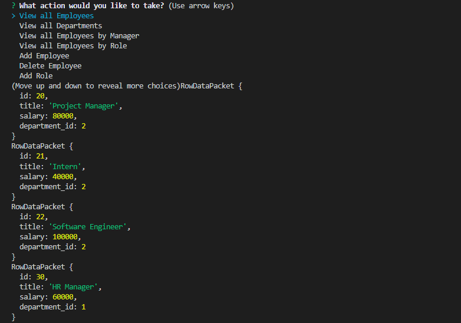

# employee-database
Manage employee database through this command-line application
  
  
  
  
  ## Table of Contents
  1. [Installation](#Installation)
  2. [Usage](#Usage)
  3. [Video](#Video)
  4. [License](#License)
  5. [Contributing](#Contributing)
  6. [Questions](#Questions)
  
  ## Installation 
  Clone this repository by clicking on the green button that says 'Code'
  
  Remeber to run the command 
  
  > npm i
  
  Or
  
  > npm install
  
  to install dependencies before running the application on the command line.
  
  ## Usage
  Invoke the applicaton with the command 
  
  > node server.js 
  
  Answer the prompts that appear in the command line. You will be asked to explore employee roster, explore departments, change roles and much more. From there, you may choose to view an exployees salary or their role within the team.
  If there is an error in running this program, an error message will apppear in the console.
  

  
  
  ## Video
  
  Watch the demo video
  
  [EMPLOYEE DATABASE](https://www.youtube.com/watch?v=hyltPxZ_oCA&feature=youtu.be "DATABASE")
  
  
  ## License
  This project operates under the MIT license
  
  
  
  ## Contributing 
  Contributions are welcome
  
  ## Questions
  
  GITHUB: https://github.com/angeleefshaw
  EMAIL: angeleefshaw@gmail.com
  LINKEDIN: https://www.linkedin.com/in/angelee-shaw-2a65861bb/
  
